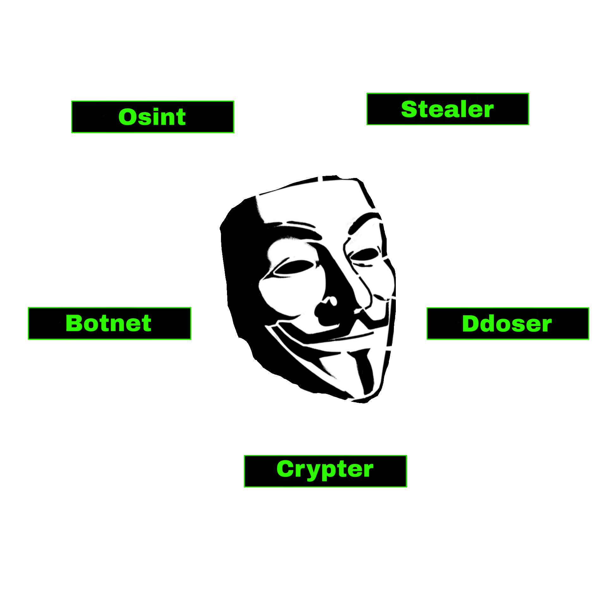

  <a href="رابط_المدونة_هنا" style="text-decoration: none; display: inline-flex; align-items: center;">
    
    مدونتنا على بلوجر: اضغط هنا للزيارة
  </a>

<table>
  <tr>
    <td align="center">
      
    </td>
    <td>
      <a href="https://baylak-egypt.blogspot.com" style="text-decoration: none; color: inherit;">
        <strong>مدونتنا على بلوجر</strong>
      </a>
    </td>
  </tr>
</table>

<table>
  <tr>
    <td align="center">
      
    </td>
    <td>
      <a href="ضع_رابط_مدونتك_هنا">مدونتنا على بلوجر: اضغط هنا للزيارة</a>
    </td>
  </tr>
</table>

أهلاً بك في مساحتي الرقمية. أنا **محمد حمادة**، مطور برمجيات وباحث في الأمن السيبراني، أعيش في العالم الرقمي بين بناء الأنظمة (OS development) وأتمتة المهام الأمنية.

[![Typing SVG](https://readme-typing-svg.demolab.com?font=Fira+Code&duration=1&background=001CFF&color=0DAC00FF&pause=25&width=750&lines=k_____________;_k____________;__k___________;___k__________;____k_________;_____k________;______k_______;_______k______;________k_____;_________k____;__________k___;___________k__;____________k_;_____________k;a____________k;_a___________k;__a__________k;___a_________k;____a________k;_____a_______k;______a______k;_______a_____k;________a____k;_________a___k;__________a__k;___________a_k;____________ak;L___________ak;_L__________ak;__L_________ak;___L________ak;____L_______ak;_____L______ak;______L_____ak;_______L____ak;________L___ak;_________L__ak;__________L_ak;___________Lak;y__________Lak;_y_________Lak;__y________Lak;___y_______Lak;____y______Lak;_____y_____Lak;______y____Lak;_______y___Lak;________y__Lak;_________y_Lak;__________yLak;a_________yLak;_a________yLak;__a_______yLak;___a______yLak;____a_____yLak;_____a____yLak;______a___yLak;_______a__yLak;________a_yLak;_________ayLak;________BayLak;_______BayLak_;______BayLak_E;_____BayLak_Eg;____BayLak_Egy;___BayLak_Egyp;__BayLak_Egypt;_BayLak_Egypt;BayLak_Egypt;BayLak_Egypt;BayLak_Egypt;BayLak_Egypt;BayLak_Egypt;BayLak_Egypt;BayLak_Egypt;BayLak_Egypt;BayLak_Egypt;BayLak_Egypt;BayLak_Egypt;BayLak_Egypt;BayLak_Egypt;BayLak_Egypt;BayLak_Egypt;BayLak_Egypt;BayLak_Egypt;BayLak_Egypt;____________)](https://github.com/BayLak-Egypt/)
 

&nbsp;

&nbsp;

### 🛡️ عني
*   **الموقع:** الإسكندرية، مصر 🇪🇬
*   **التخصص:** Full-Stack Development & Cybersecurity Research.
*   **الاهتمامات:** الأنظمة منخفضة المستوى (Low-level)، هندسة البرمجيات، وأدوات الـ OSINT.
*   **الشغف:** تحويل الأفكار المعقدة إلى أدوات عملية بلمسة "super hacker".

---

### 💻 التقنيات والأدوات اللي بستخدمها

| الفئة | المهارات |
| :--- | :--- |
| **أنظمة التشغيل** |  |
| **قواعد البيانات** |  |
| **أدوات وخدمات** |  |

  
  
  
  
  
  
  
  
  
  
  
  
  

---

### 🌐 تواصل معي

---

### 📊 إحصائيات GitHub

---

### 🐍 سناك المساهمات

<picture>
  <source media="(prefers-color-scheme: dark)" srcset="https://raw.githubusercontent.com/BayLak-Egypt/BayLak-Egypt/output/github-contribution-grid-snake-dark.svg" />
  <source media="(prefers-color-scheme: light)" srcset="https://raw.githubusercontent.com/BayLak-Egypt/BayLak-Egypt/output/github-contribution-grid-snake.svg" />
  
</picture>

> "تذكر دائماً: البرمجة هي المفتاح، والأمن هو الحصن."
